# Portfolio of Calvin Chee:

---
# Summative Capstone Project: Data Analysis using Python, SQL and Power BI

**Project description:** The main aim of the capstone project is to exhibit the different stages of the data lifecycle through the use of various tools and techniques.

## 1. Imported data from Kaggle website

## 2. Performed data preparation (Data cleaning & transformation)

## 3. Performed Exploratory Data Analysis (EDA) 

## 4. Performed sentimental analysis by creating machine learning models and evaluating performance

## 5. Created interactive dashboard & visualization using Power BI 

## 6. Presenting to the stakeholders and communicating insights

## - [Summative Capstone Project Presentation Link](/pdf/Summative_Capstone_Presentation.pdf)

---
## Capstone Project 4: Machine Learning with Python

**Project description:** The main aim of the capstone project is to exhibit the different stages of the data lifecycle through the use of various machine learning algorithms: Linear Regression, Logistic Regression, SVM, K-means, Random Forest and any other machine learning models.

## 1. Imported data from Kaggle website

## 2. Performed data preparation (Data cleaning & transformation)

## 3. Performed Exploratory Data Analysis (EDA) 

## 4. Data analysis using visualizations with Python

## 5. Creating Machine learning models and evaluating performance 

## 6. Presenting to the stakeholders and communicating insights

## - [Capstone Project 4 Presentation Link](/pdf/Capstone_Project_4_Presentation.pdf)

---
# Capstone Project 3: Creating Interactive Dashboard with Power BI

**Project description:** The main aim of the capstone project is to exhibit the stages of the data lifecycle using Power BI on the dataset.

## 1. Imported data from Kaggle website

## 2. Performed data preparation (Data cleaning & transformation)

## 3. Visualizing and formatting the data on Power BI

## 4. Created interactive dashboard & visualization using Power BI

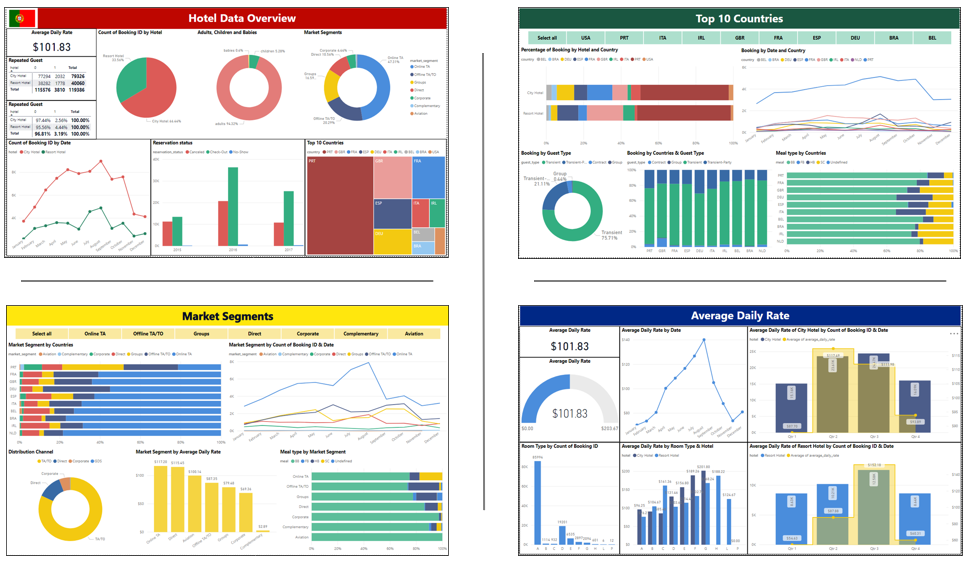

## 5. Presenting to the stakeholders and communicating insights

## - [Capstone Project 3 Presentation Link](/pdf/Capstone_Project_3_Presentation.pdf)

---
# Capstone Project 2: Data Analysis using SQL and Creating Interactive Dashboard using Excel

**Project description:** The main aim of the capstone project is to exhibit the different stages of the data lifecycle through the use of two tools: SQL and MS Excel.

## 1. Data collection from Kaggle website

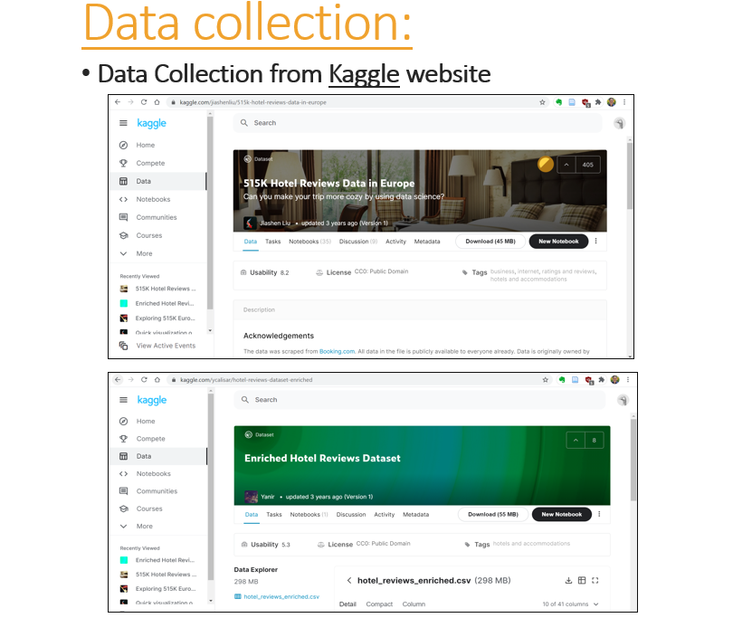

## 2. Performed data cleaning & transformation on Microsoft Excel and SQL

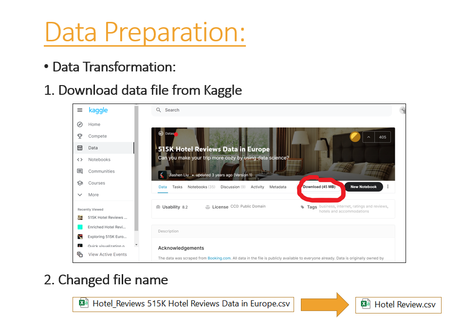

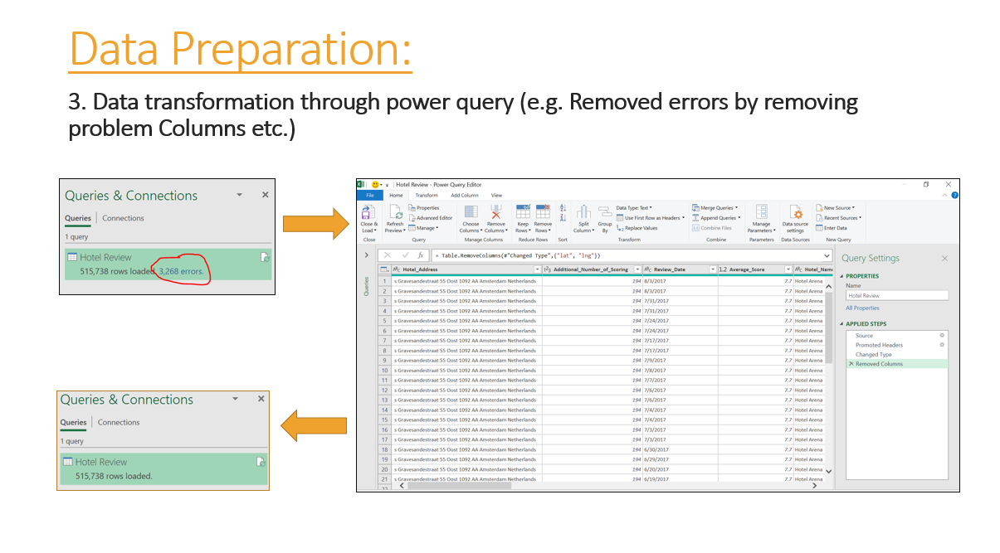

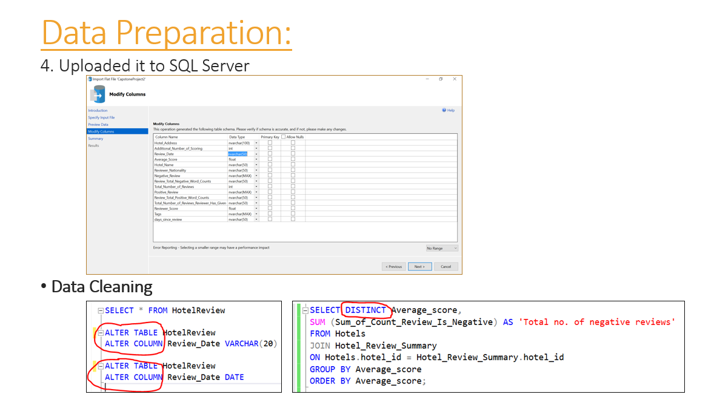

## 3. Created tables & loaded data into SQL databases

Design the database schema, create the required tables, relationships and insert data sources in the above step into the respective SQL tables.

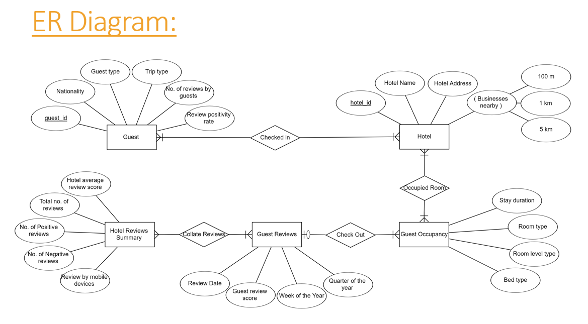

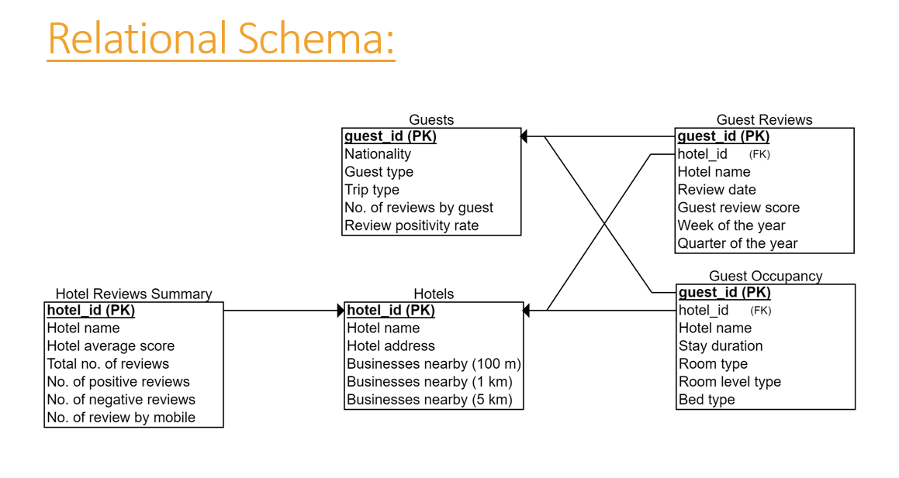

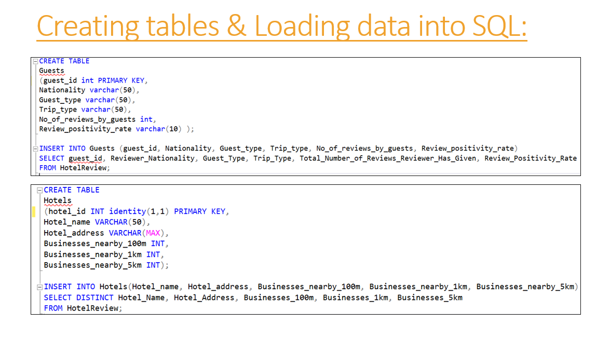

## 4. Data analysis using SQL 

Perform analysis on the data to derive useful insights. Make use of different SQL operations such as joins, grouping, filters and others during analysis.

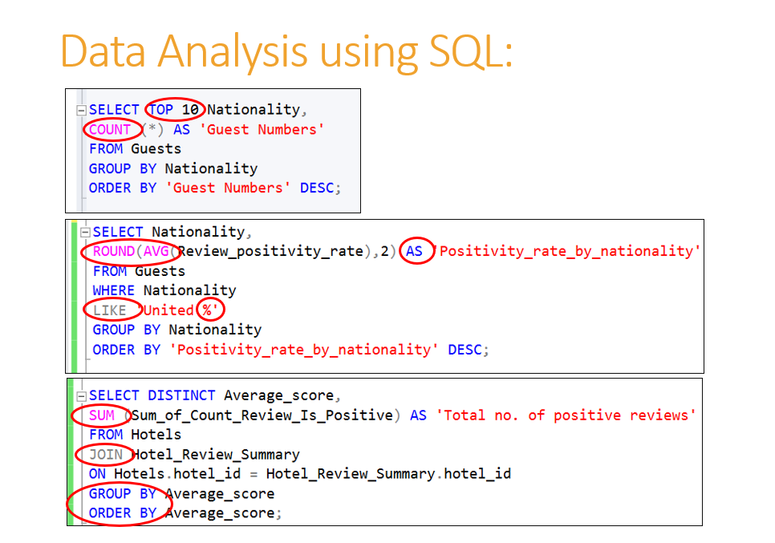

## 5. Created interactive dashboard & visualization using Excel

Once all the data has been prepared in SQL, import the data into Excel directly from SQL. Create required pivot tables and charts to create reports and dashboards which help in visualizing the data and also in drawing useful insights. Create multiple reports from the data which help you tell a story to the stakeholders.

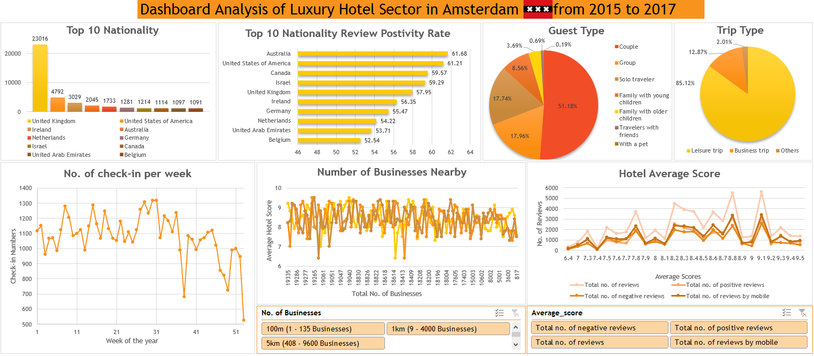

## 6. Presenting to the stakeholders and communicating insights

Create a story and business questions which will help you drive the presentation. Once created all the required reports and dashboards, it would be presented to the stakeholders.

## - [Capstone Project 2 Presentation Link](/pdf/Capstone_Project_2_Presentation.pdf)

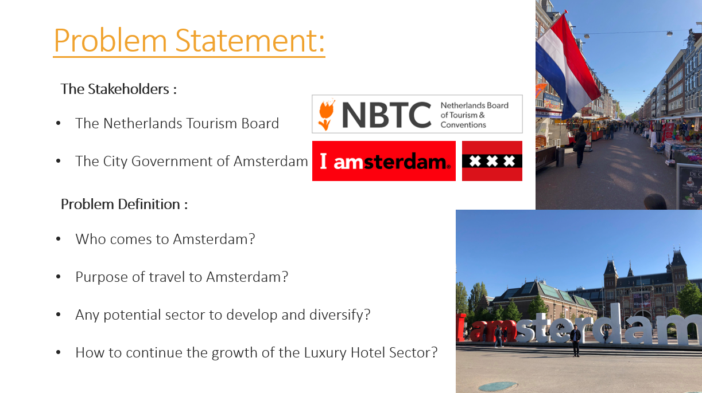

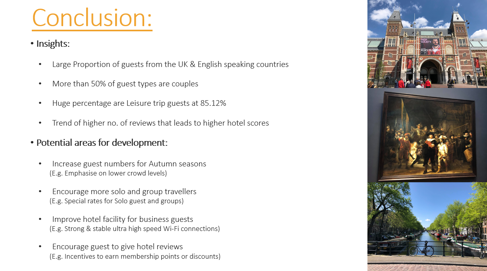

---
# Capstone Project 1: Creating Interactive Dashboards and Data Storytelling with Excel

**Project description:** The main aim of the capstone project is to exhibit the different stages of the data lifecycle through the use of the tool: Microsoft Excel.

## 1. Data collection from various sources

A domain of choice can be chosen on which analysis needs to be done. Areas could be sales, marketing, finance, retail, healthcare, or others.

**Data Source:** Singapore Tourism Analytics Network (STAN) website [https://stan.stb.gov.sg/content/stan/en/tourism-statistics.html]

## 2. Business needs gathering and Story building in relation to business needs

This is the stage to decide on a real-world scenario with a real business or company and to decide on a convincing business need which can be used for the chosen dataset. After gathering the business needs, the next task is to build a storyline behind the data and the business needs. This is to be iterated and refined based on the business needs.

**Target Audience: Singapore Tourism Board (STB) Management** 

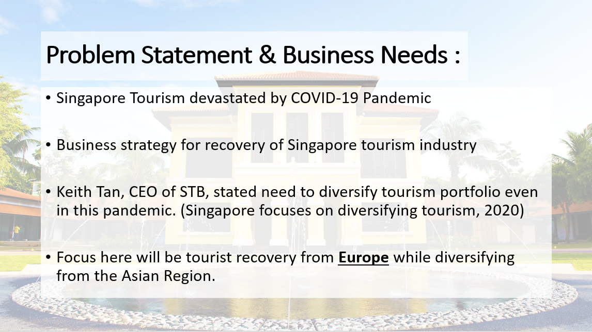

## 3. Data Preparation 

After creating all the required tables and loading in the raw data, perform data cleaning and transformation operations:

1. Cleaned unwanted data
2. Created and derived new columns
3. Removed anomalies and outliers in the data
4. Removed inconsistencies
5. And others.

## 4. Creating Interactive Dashboard and Visualization using Excel Dashboards

Create required pivot tables and charts to create reports and dashboards which help in visualizing the data and also in drawing useful insights. Create multiple reports from the data which help you tell a story to the stakeholders.

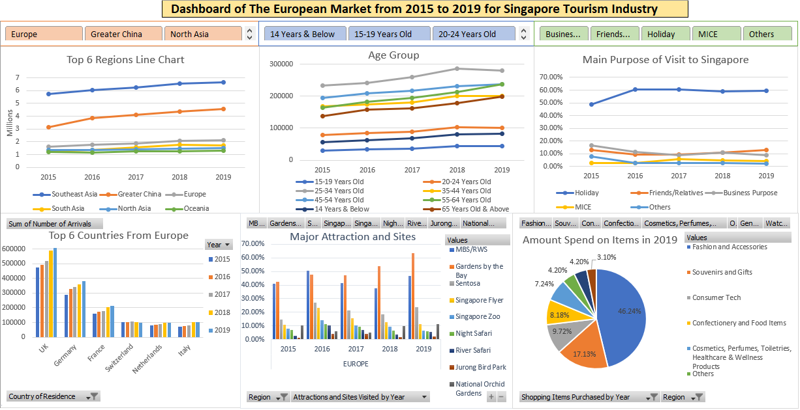

## 5. Presenting to the stakeholders and communicating insights derived based on decided business needs

Present the dashboards in a way which will help to drive the presentation towards the “aha” moment.

## - [Capstone Project 1 Presentation Link](/pdf/Capstone_Project_1_Presentation.pdf)

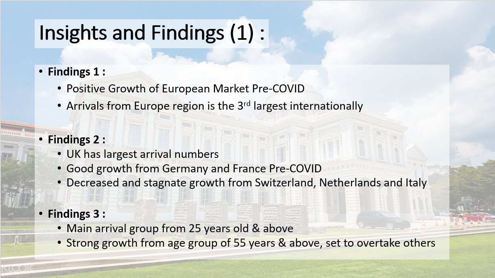

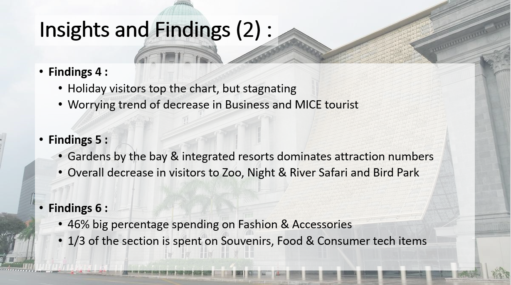
